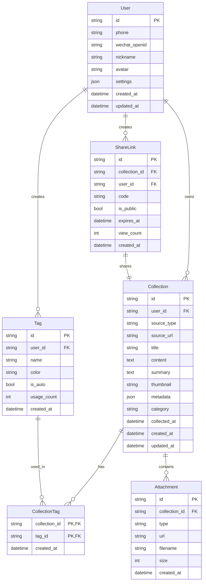

# 一键收藏系统 (QuickSave) 需求规格文档

## 1. 项目概述

### 1.1 项目定位
- **项目名称**: QuickSave (一键收藏系统)
- **项目类型**: Windows 桌面应用 + 浏览器扩展 + Web 管理平台
- **应用领域**: 个人知识管理 / 内容收藏工具
- **目标用户**: 有大量信息收集需求的知识工作者、内容创作者
- **商业模式**: 潜在商业产品

### 1.2 核心价值
通过全局快捷键一键收藏来自各种软件和网站的内容，自动进行智能分类和标签，提供统一的内容管理和检索体验。

### 1.3 核心场景
1. **浏览器收藏**: 快捷键一键收藏当前网页/选中内容
2. **微信/企微收藏**: 截图识别或剪贴板监听收藏聊天内容、公众号文章、视频号
3. **视频平台**: 收藏 B站/抖音/YouTube 视频链接和元信息
4. **开发资料**: 收藏 GitHub 仓库、Stack Overflow 问答、技术博客

---

## 2. 功能需求

### 2.1 用户系统

| 功能 | 描述 | 优先级 |
|------|------|--------|
| 手机号注册/登录 | 短信验证码登录 | P0 |
| 微信登录 | 微信扫码一键登录 | P0 |
| 用户信息管理 | 头像、昵称、个人设置 | P1 |
| 设备管理 | 查看已登录设备、强制下线 | P2 |

### 2.2 内容收藏 (核心功能)

#### 2.2.1 触发方式
| 方式 | 描述 | 优先级 |
|------|------|--------|
| 全局快捷键 | 可自定义快捷键，任意窗口触发 | P0 |
| 浏览器扩展按钮 | 点击图标收藏当前页面 | P0 |
| 右键菜单 | 选中内容右键收藏 | P1 |

#### 2.2.2 支持的内容来源

**浏览器 (Chrome/Edge)**
| 内容类型 | 抓取信息 | 优先级 |
|----------|----------|--------|
| 网页 | 标题、URL、缩略图、正文摘要 | P0 |
| 选中文本 | 选中内容、来源页面 | P0 |
| 图片 | 图片URL、来源页面、下载备份 | P1 |
| 视频 | 视频标题、封面、时长、平台 | P1 |

**微信/企业微信**
| 内容类型 | 获取方式 | 优先级 |
|----------|----------|--------|
| 聊天记录 | 截图 + OCR 识别 | P0 |
| 公众号文章 | 链接解析 + 全文抓取 | P0 |
| 视频号 | 截图 + 链接提取 | P1 |
| 朋友圈 | 截图 + OCR 识别 | P1 |
| 文件 | 剪贴板监听 | P2 |

**视频平台**
| 平台 | 抓取信息 | 优先级 |
|------|----------|--------|
| B站 | 标题、封面、UP主、播放量、时长 | P0 |
| YouTube | 标题、封面、频道、时长 | P1 |
| 抖音 | 标题、封面、作者 | P2 |

**开发工具**
| 平台 | 抓取信息 | 优先级 |
|------|----------|--------|
| GitHub | 仓库名、描述、Stars、README | P0 |
| Stack Overflow | 问题、最佳答案、标签 | P1 |
| 技术博客 | 标题、正文、作者 | P1 |

#### 2.2.3 内容处理流程
```
触发收藏 → 识别来源 → 抓取内容 → AI处理 → 存储 → 同步
                           ↓
                   - 基础信息提取
                   - 富媒体下载
                   - OCR文字识别
                           ↓
                   - 自动生成标签
                   - 内容摘要
                   - 智能分类
```

### 2.3 智能处理 (AI 功能)

| 功能 | 描述 | 优先级 |
|------|------|--------|
| 自动标签 | 根据内容自动生成标签 | P0 |
| 智能分类 | 自动归入合适的分类 | P0 |
| 内容摘要 | 长文自动生成摘要 | P1 |
| 相关推荐 | 展示相似的收藏内容 | P2 |
| OCR识别 | 图片/截图文字提取 | P0 |

**AI 配置**
- 支持用户自选 AI 提供商 (通义千问/OpenAI/本地模型)
- 支持配置 API Key
- 支持选择不同模型

### 2.4 内容管理

#### 2.4.1 组织方式
| 功能 | 描述 | 优先级 |
|------|------|--------|
| 智能分类 | 系统自动分类 + 用户可调整 | P0 |
| 全文搜索 | 搜索标题、正文、标签 | P0 |
| 筛选过滤 | 按来源、时间、类型筛选 | P1 |
| 自定义标签 | 用户手动添加/编辑标签 | P1 |

#### 2.4.2 视图模式
| 视图 | 描述 | 优先级 |
|------|------|--------|
| 列表视图 | 紧凑列表，适合快速浏览 | P0 |
| 卡片视图 | 带缩略图的卡片，适合图片内容 | P0 |
| 详情视图 | 展开完整内容 | P1 |
| 时间线视图 | 按时间排列 | P2 |

### 2.5 数据管理

| 功能 | 描述 | 优先级 |
|------|------|--------|
| 导入 | 从 Pocket/Raindrop/浏览器书签导入 | P1 |
| 导出 | 导出为 JSON/Markdown/HTML | P1 |
| 备份恢复 | 数据备份和恢复 | P1 |
| 统计分析 | 收藏数量趋势、标签分布、来源分析 | P2 |

### 2.6 分享功能

| 功能 | 描述 | 优先级 |
|------|------|--------|
| 分享链接 | 生成公开/私密分享链接 | P1 |
| 链接有效期 | 设置分享链接过期时间 | P2 |
| 访问统计 | 查看分享链接访问次数 | P2 |

---

## 3. 技术架构

### 3.1 系统架构图

```
┌─────────────────────────────────────────────────────────────────┐
│                         用户层                                   │
├──────────────────┬──────────────────┬──────────────────────────┤
│  Flutter Desktop │  Browser Extension│      Web Dashboard       │
│   (Windows客户端)  │  (Chrome/Edge)    │     (管理后台)           │
├──────────────────┴──────────────────┴──────────────────────────┤
│                         API Gateway                             │
├─────────────────────────────────────────────────────────────────┤
│                    阿里云 FC (FastAPI)                          │
├────────────┬────────────┬────────────┬─────────────────────────┤
│  用户服务   │  收藏服务   │  AI服务    │     内容抓取服务        │
├────────────┴────────────┴────────────┴─────────────────────────┤
│                         数据层                                   │
├──────────────────┬──────────────────┬──────────────────────────┤
│  阿里云 Tablestore │    阿里云 OSS    │   阿里云 Elasticsearch   │
│    (主数据库)      │   (文件存储)     │     (全文搜索)           │
└──────────────────┴──────────────────┴──────────────────────────┘
```

### 3.2 技术栈选型

| 组件 | 技术选型 | 说明 |
|------|----------|------|
| 桌面客户端 | Flutter Desktop | 跨平台、UI丰富、Dart语言 |
| 浏览器扩展 | Chrome Extension V3 | Manifest V3，兼容 Edge |
| Web 管理端 | Flutter Web | 与桌面端共享代码 |
| 后端服务 | Python FastAPI | 异步高性能，AI生态好 |
| 部署平台 | 阿里云 FC | Serverless，按量付费 |
| 主数据库 | 阿里云 Tablestore | NoSQL，自动扩容 |
| 文件存储 | 阿里云 OSS | 图片、视频文件存储 |
| 搜索引擎 | 阿里云 Elasticsearch | 全文搜索 |
| AI 服务 | 通义千问 API (可配置) | 标签生成、摘要、分类 |
| OCR 服务 | 阿里云 OCR / PaddleOCR | 图片文字识别 |

### 3.3 客户端架构 (Flutter)

```
lib/
├── main.dart
├── app/
│   ├── app.dart
│   ├── routes.dart
│   └── theme.dart
├── core/
│   ├── config/           # 配置管理
│   ├── network/          # 网络请求
│   ├── storage/          # 本地存储
│   ├── hotkey/           # 全局快捷键
│   ├── clipboard/        # 剪贴板监听
│   ├── screenshot/       # 截图功能
│   └── ocr/              # OCR集成
├── features/
│   ├── auth/             # 登录注册
│   ├── capture/          # 内容抓取
│   ├── collection/       # 收藏管理
│   ├── search/           # 搜索
│   ├── settings/         # 设置
│   └── share/            # 分享
├── shared/
│   ├── models/           # 数据模型
│   ├── widgets/          # 通用组件
│   └── utils/            # 工具函数
└── services/
    ├── api_service.dart
    ├── ai_service.dart
    └── sync_service.dart
```

### 3.4 后端架构 (FastAPI)

```
app/
├── main.py
├── core/
│   ├── config.py         # 配置
│   ├── security.py       # 认证授权
│   └── deps.py           # 依赖注入
├── api/
│   ├── v1/
│   │   ├── auth.py       # 认证接口
│   │   ├── collections.py # 收藏接口
│   │   ├── tags.py       # 标签接口
│   │   ├── search.py     # 搜索接口
│   │   └── share.py      # 分享接口
│   └── router.py
├── services/
│   ├── capture/          # 内容抓取
│   │   ├── browser.py
│   │   ├── wechat.py
│   │   ├── video.py
│   │   └── github.py
│   ├── ai/               # AI处理
│   │   ├── tagger.py
│   │   ├── summarizer.py
│   │   └── classifier.py
│   ├── ocr/              # OCR服务
│   └── storage/          # 存储服务
├── models/               # 数据模型
├── schemas/              # Pydantic schemas
└── utils/                # 工具函数
```

---

## 4. 数据模型

### 4.1 ER 图



### 4.2 主要表结构

```sql
-- 用户表
CREATE TABLE users (
    id VARCHAR(36) PRIMARY KEY,
    phone VARCHAR(20) UNIQUE,
    wechat_openid VARCHAR(64) UNIQUE,
    nickname VARCHAR(50),
    avatar VARCHAR(255),
    settings JSON,
    created_at TIMESTAMP DEFAULT CURRENT_TIMESTAMP,
    updated_at TIMESTAMP DEFAULT CURRENT_TIMESTAMP
);

-- 收藏表
CREATE TABLE collections (
    id VARCHAR(36) PRIMARY KEY,
    user_id VARCHAR(36) NOT NULL,
    source_type VARCHAR(30) NOT NULL,  -- browser, wechat, bilibili, github...
    source_url TEXT,
    title VARCHAR(500),
    content LONGTEXT,
    summary TEXT,
    thumbnail VARCHAR(255),
    metadata JSON,  -- 不同来源的扩展信息
    category VARCHAR(50),
    collected_at TIMESTAMP,
    created_at TIMESTAMP DEFAULT CURRENT_TIMESTAMP,
    updated_at TIMESTAMP DEFAULT CURRENT_TIMESTAMP,
    INDEX idx_user_id (user_id),
    INDEX idx_source_type (source_type),
    INDEX idx_collected_at (collected_at),
    FULLTEXT INDEX ft_content (title, content)
);

-- 标签表
CREATE TABLE tags (
    id VARCHAR(36) PRIMARY KEY,
    user_id VARCHAR(36) NOT NULL,
    name VARCHAR(50) NOT NULL,
    color VARCHAR(7),
    is_auto BOOLEAN DEFAULT FALSE,
    usage_count INT DEFAULT 0,
    created_at TIMESTAMP DEFAULT CURRENT_TIMESTAMP,
    UNIQUE KEY uk_user_tag (user_id, name)
);

-- 收藏-标签关联表
CREATE TABLE collection_tags (
    collection_id VARCHAR(36) NOT NULL,
    tag_id VARCHAR(36) NOT NULL,
    created_at TIMESTAMP DEFAULT CURRENT_TIMESTAMP,
    PRIMARY KEY (collection_id, tag_id)
);

-- 附件表
CREATE TABLE attachments (
    id VARCHAR(36) PRIMARY KEY,
    collection_id VARCHAR(36) NOT NULL,
    type VARCHAR(20),  -- image, video, file
    url VARCHAR(500),
    filename VARCHAR(255),
    size BIGINT,
    created_at TIMESTAMP DEFAULT CURRENT_TIMESTAMP,
    INDEX idx_collection_id (collection_id)
);

-- 分享链接表
CREATE TABLE share_links (
    id VARCHAR(36) PRIMARY KEY,
    collection_id VARCHAR(36) NOT NULL,
    user_id VARCHAR(36) NOT NULL,
    code VARCHAR(10) UNIQUE,
    is_public BOOLEAN DEFAULT TRUE,
    expires_at TIMESTAMP,
    view_count INT DEFAULT 0,
    created_at TIMESTAMP DEFAULT CURRENT_TIMESTAMP,
    INDEX idx_code (code)
);
```

---

## 5. API 设计

### 5.1 认证接口

```yaml
POST /api/v1/auth/sms/send
  # 发送短信验证码
  Request:
    phone: string
  Response:
    success: boolean

POST /api/v1/auth/sms/login
  # 短信验证码登录
  Request:
    phone: string
    code: string
  Response:
    access_token: string
    refresh_token: string
    user: User

POST /api/v1/auth/wechat/login
  # 微信登录
  Request:
    code: string
  Response:
    access_token: string
    user: User

POST /api/v1/auth/refresh
  # 刷新Token
  Request:
    refresh_token: string
  Response:
    access_token: string

GET /api/v1/auth/me
  # 获取当前用户信息
  Response:
    user: User
```

### 5.2 收藏接口

```yaml
POST /api/v1/collections
  # 创建收藏
  Request:
    source_type: string       # browser, wechat, bilibili, github...
    source_url: string?
    title: string?
    content: string?
    screenshot: base64?       # 截图数据
    auto_process: boolean     # 是否自动AI处理
  Response:
    collection: Collection

GET /api/v1/collections
  # 获取收藏列表
  Query:
    page: int
    size: int
    source_type: string?
    category: string?
    tag: string?
    q: string?               # 搜索关键词
    sort: string             # collected_at, created_at
  Response:
    items: Collection[]
    total: int
    page: int

GET /api/v1/collections/{id}
  # 获取收藏详情
  Response:
    collection: Collection
    related: Collection[]    # 相关推荐

PUT /api/v1/collections/{id}
  # 更新收藏
  Request:
    title: string?
    content: string?
    category: string?
    tags: string[]?
  Response:
    collection: Collection

DELETE /api/v1/collections/{id}
  # 删除收藏
  Response:
    success: boolean

POST /api/v1/collections/{id}/reprocess
  # 重新AI处理
  Response:
    collection: Collection
```

### 5.3 标签接口

```yaml
GET /api/v1/tags
  # 获取标签列表
  Query:
    q: string?
  Response:
    tags: Tag[]

POST /api/v1/tags
  # 创建标签
  Request:
    name: string
    color: string?
  Response:
    tag: Tag

PUT /api/v1/tags/{id}
  # 更新标签
  Request:
    name: string?
    color: string?
  Response:
    tag: Tag

DELETE /api/v1/tags/{id}
  # 删除标签
  Response:
    success: boolean
```

### 5.4 搜索接口

```yaml
GET /api/v1/search
  # 全文搜索
  Query:
    q: string
    source_type: string?
    category: string?
    tags: string?
    date_from: date?
    date_to: date?
    page: int
    size: int
  Response:
    items: Collection[]
    total: int
    facets:
      source_types: {type: count}[]
      categories: {category: count}[]
      tags: {tag: count}[]
```

### 5.5 分享接口

```yaml
POST /api/v1/share
  # 创建分享链接
  Request:
    collection_id: string
    expires_in: int?         # 过期时间(秒)
  Response:
    share_link: ShareLink
    url: string

GET /api/v1/share/{code}
  # 访问分享内容 (无需登录)
  Response:
    collection: Collection

DELETE /api/v1/share/{id}
  # 删除分享链接
  Response:
    success: boolean
```

### 5.6 统计接口

```yaml
GET /api/v1/stats/overview
  # 总览统计
  Response:
    total_collections: int
    total_tags: int
    this_week: int
    this_month: int

GET /api/v1/stats/trend
  # 收藏趋势
  Query:
    period: day|week|month
    days: int
  Response:
    data: {date: string, count: int}[]

GET /api/v1/stats/sources
  # 来源分布
  Response:
    data: {source: string, count: int}[]

GET /api/v1/stats/tags
  # 标签统计
  Response:
    data: {tag: string, count: int}[]
```

---

## 6. UI/UX 设计

### 6.1 设计原则
- **简洁高效**: 减少操作步骤，快速完成收藏
- **信息层次**: 清晰的视觉层级，重要信息突出
- **一致性**: 跨平台保持一致的设计语言
- **可定制**: 支持主题切换、布局调整

### 6.2 关键页面

#### 6.2.1 桌面端托盘菜单
```
┌─────────────────────────┐
│ ⚡ 一键收藏 (Ctrl+Shift+S)│
├─────────────────────────┤
│ 📋 从剪贴板收藏          │
│ 📸 截图收藏              │
├─────────────────────────┤
│ 📊 今日已收藏: 12 条     │
├─────────────────────────┤
│ ⚙️ 设置                  │
│ 🌐 打开管理面板          │
│ ❌ 退出                  │
└─────────────────────────┘
```

#### 6.2.2 收藏成功浮窗
```
┌────────────────────────────────┐
│ ✓ 收藏成功                      │
├────────────────────────────────┤
│ 📄 Flutter 状态管理最佳实践     │
│ 🏷️ #Flutter #状态管理 #技术    │
│ 📁 自动归类: 开发/Flutter       │
├────────────────────────────────┤
│ [编辑] [查看] [关闭]            │
└────────────────────────────────┘
```

#### 6.2.3 管理面板 - 列表视图
```
┌──────────────────────────────────────────────────────────────────┐
│ QuickSave                    🔍 搜索...              👤 用户     │
├──────────────┬───────────────────────────────────────────────────┤
│ 📑 全部 (128) │  📋 列表 | 🎴 卡片 | ⏱️ 时间线                    │
│              ├───────────────────────────────────────────────────┤
│ 📁 分类      │ □ Flutter 状态管理最佳实践           ⭐ 🔗 ...    │
│   开发 (45)  │   📍 juejin.cn · 2小时前                          │
│   设计 (23)  │   🏷️ Flutter 状态管理 技术                        │
│   视频 (30)  │ ─────────────────────────────────────────────────│
│   文章 (30)  │ □ GitHub - riverpod                  ⭐ 🔗 ...    │
│              │   📍 github.com · 3小时前                         │
│ 🏷️ 标签      │   🏷️ Flutter 状态管理 开源                        │
│   Flutter    │ ─────────────────────────────────────────────────│
│   Python     │ □ 微信公众号: 前端早读课              ⭐ 🔗 ...    │
│   AI        │   📍 微信 · 昨天                                   │
│              │   🏷️ 前端 JavaScript                             │
├──────────────┴───────────────────────────────────────────────────┤
│ 📊 本周收藏 28 条 · 最常用标签: Flutter (15)                      │
└──────────────────────────────────────────────────────────────────┘
```

#### 6.2.4 管理面板 - 卡片视图
```
┌──────────────────────────────────────────────────────────────────┐
│ ┌─────────────┐ ┌─────────────┐ ┌─────────────┐ ┌─────────────┐ │
│ │ 📷 缩略图   │ │ 📷 缩略图   │ │ 📷 缩略图   │ │ 📷 缩略图   │ │
│ │             │ │             │ │             │ │             │ │
│ ├─────────────┤ ├─────────────┤ ├─────────────┤ ├─────────────┤ │
│ │ 标题...     │ │ 标题...     │ │ 标题...     │ │ 标题...     │ │
│ │ 🏷️ tag tag  │ │ 🏷️ tag tag  │ │ 🏷️ tag tag  │ │ 🏷️ tag tag  │ │
│ └─────────────┘ └─────────────┘ └─────────────┘ └─────────────┘ │
└──────────────────────────────────────────────────────────────────┘
```

### 6.3 浏览器扩展

```
┌─────────────────────────────┐
│ QuickSave          [登录]   │
├─────────────────────────────┤
│ 📄 当前页面                 │
│ Flutter 状态管理最佳实践    │
├─────────────────────────────┤
│ 🏷️ 标签: (自动检测)         │
│ [Flutter] [状态管理] [+]    │
├─────────────────────────────┤
│ 📁 分类: 开发/Flutter    ▼  │
├─────────────────────────────┤
│      [收藏此页面]           │
│ ────────────────────────── │
│ [收藏选中内容] [截图收藏]   │
└─────────────────────────────┘
```

---

## 7. 非功能性需求

### 7.1 性能要求

| 指标 | 目标值 | 说明 |
|------|--------|------|
| 收藏响应时间 | < 500ms | 从触发到显示成功提示 |
| 列表加载时间 | < 1s | 首屏50条数据 |
| 搜索响应时间 | < 500ms | 全文搜索返回结果 |
| AI处理时间 | < 3s | 标签生成、摘要提取 |
| 客户端启动 | < 2s | 冷启动到可操作 |
| 内存占用 | < 150MB | 托盘常驻时 |

### 7.2 可用性要求

| 指标 | 目标值 |
|------|--------|
| 系统可用性 | 99.9% |
| 数据持久性 | 99.99% |
| 同步成功率 | 99.5% |

### 7.3 安全要求

| 要求 | 描述 |
|------|------|
| 传输加密 | 全程 HTTPS |
| 认证机制 | JWT Token + Refresh Token |
| 数据隔离 | 用户数据严格隔离 |
| 敏感信息 | 密码哈希存储，不存储明文 |

### 7.4 兼容性要求

| 平台 | 版本要求 |
|------|----------|
| Windows | Windows 10+ |
| Chrome | v100+ |
| Edge | v100+ |
| 现代浏览器 | Web管理端 |

---

## 8. 开发计划

### 8.1 里程碑规划

#### M1: 基础框架
- [ ] 项目初始化和基础架构搭建
- [ ] 用户认证系统 (手机号 + 微信)
- [ ] 阿里云 FC + Tablestore 部署
- [ ] Flutter 桌面端框架

#### M2: 核心收藏功能
- [ ] 全局快捷键实现
- [ ] 浏览器扩展开发 (Chrome/Edge)
- [ ] 基础内容抓取 (网页、链接)
- [ ] 收藏列表管理

#### M3: 智能处理
- [ ] AI 服务集成 (通义千问)
- [ ] 自动标签生成
- [ ] 智能分类
- [ ] 内容摘要

#### M4: 微信生态支持
- [ ] 截图 OCR 识别
- [ ] 剪贴板监听
- [ ] 微信公众号内容抓取
- [ ] 视频号链接解析

#### M5: 高级功能
- [ ] 全文搜索 (Elasticsearch)
- [ ] 视频平台支持 (B站/YouTube)
- [ ] GitHub/技术博客支持
- [ ] 分享链接功能

#### M6: Web管理端
- [ ] Flutter Web 管理面板
- [ ] 多视图切换
- [ ] 统计分析
- [ ] 导入导出

#### M7: 优化和发布
- [ ] 性能优化
- [ ] UI/UX 打磨
- [ ] 测试和Bug修复
- [ ] 发布准备

### 8.2 功能优先级总览

| 优先级 | 功能模块 |
|--------|----------|
| P0 | 用户认证、全局快捷键、网页收藏、标签系统、智能分类、搜索 |
| P1 | 浏览器扩展、微信内容收藏、AI摘要、多视图、导入导出 |
| P2 | 视频平台、开发工具、分享链接、统计分析、相关推荐 |

---

## 9. 风险和依赖

### 9.1 技术风险

| 风险 | 影响 | 缓解措施 |
|------|------|----------|
| 微信内容抓取受限 | 核心功能受影响 | 多种方案组合(截图+OCR+剪贴板) |
| AI API 成本 | 运营成本增加 | 本地模型降级方案 |
| 第三方网站结构变化 | 抓取失败 | 模块化设计，快速适配 |

### 9.2 外部依赖

| 依赖 | 说明 |
|------|------|
| 阿里云服务 | FC, Tablestore, OSS, OCR |
| AI API | 通义千问/OpenAI |
| 微信开放平台 | 微信登录 |
| 短信服务 | 阿里云短信 |

---

## 10. 后续扩展计划

### 10.1 功能扩展
- [ ] 移动端 App (Flutter)
- [ ] 团队协作功能
- [ ] 知识图谱可视化
- [ ] 稍后阅读队列
- [ ] RSS 订阅集成
- [ ] 浏览器历史分析

### 10.2 平台扩展
- [ ] Mac 客户端
- [ ] iOS/Android App
- [ ] 更多浏览器支持 (Firefox, Safari)

### 10.3 商业化功能
- [ ] 会员订阅体系
- [ ] 高级AI功能
- [ ] 云存储空间扩展
- [ ] 企业版功能

---

## 附录

### A. 术语表

| 术语 | 解释 |
|------|------|
| Collection | 收藏条目 |
| Source | 内容来源 (浏览器/微信/B站等) |
| Tag | 标签 |
| Category | 分类 |
| Capture | 内容抓取 |

### B. 参考产品
- Raindrop.io - 书签管理
- Pocket - 稍后阅读
- Notion Web Clipper - 网页剪藏
- 印象笔记剪藏 - 内容收集
- Cubox - 收藏管理

---

*文档版本: 1.0*
*创建日期: 2026-01-22*
*最后更新: 2026-01-22*
